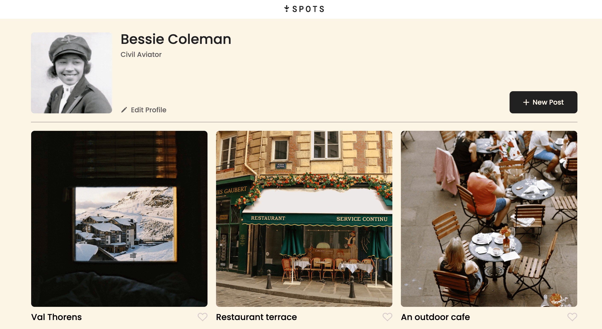

# Project 3: Spots

## Summary

Spots is a social media application in which users can upload photos, delete photos, and like other users' photos. Users can add their name, a short bio, and an avatar image.

## Technologies and Techniques

Semantic markup was written using HTML5, and styles were written using CSS3 based on the design provided on Figma, a collaborative design tool. CSS Grid, CSS Flexbox, and media queries were used to create a responsive site with columnns that adjust based on screen size. JavaScript was utilized to handle event listeners and implement form validation.

## Plans for Improvement

Currently, the site is serves as a template for the application. The site lacks social functions; there isn't an option to follow or search for other users. Additionally, the photos that are uploaded have to be uploaded using links. The use of image files would be easier for some users. The implementation of these features would create a more robust social media application.

## Page Preview

https://j6barajas.github.io/se_project_spots/

